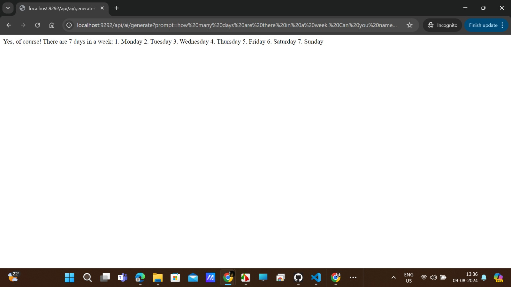
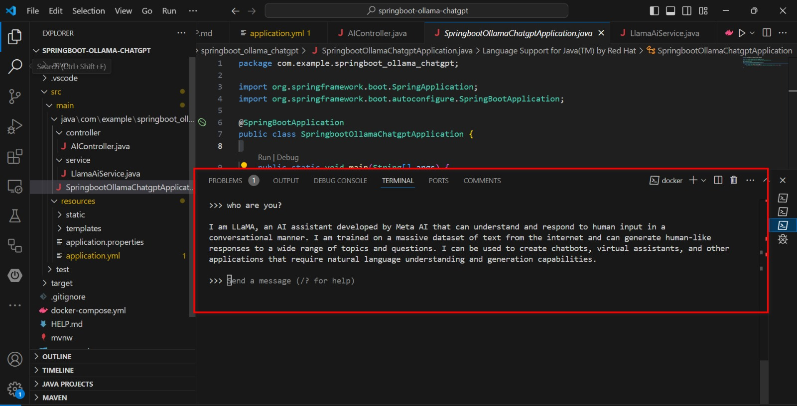

# Spring Boot Ollama ChatGPT Integration

## Overview
This project demonstrates the integration of the Meta AI's LLAMA2 chat model within a Spring Boot application, leveraging Docker for easy deployment and isolation. The LLAMA2 model is capable of understanding and generating human-like responses to various prompts, making it ideal for building advanced chatbot systems.

## Docker Configuration
The Docker environment encapsulates the Ollama service, which hosts the LLAMA2 model. Here’s what is included in the Docker setup:

- **Dockerfile**: Configures the Ollama service to run with the LLAMA2 model.
- **docker-compose.yml**: Sets up the service, including port mappings and memory limits to ensure the model has sufficient resources.

### Execution Instructions
1. **Start Docker**: Ensure Docker is installed and running on your machine.
2. **Increase Docker Memory**: Allocate at least 9GB of memory to Docker from your Docker Desktop settings to support the LLAMA2 model's requirements.
3. **Deploy Services**:

   ```bash
   docker compose -f .\docker-compose.yml up
   ```

This command starts the Ollama service in a detached mode.

### Using LLAMA2 Model in Terminal
Once the Docker container is up and running, you can interact with the LLAMA2 model directly:

```bash
docker exec -it ollama ollama run llama2
```

Follow the prompts to input your queries and get responses directly in your terminal.


## Application Architecture

### Controllers and Services
- **AIController**: Exposes a GET endpoint `/api/ai/generate` that accepts a `prompt` parameter. This controller forwards the prompt to the LLAMA2 model and returns the generated response.
- **LlamaAiService**: This service class makes use of Spring's `OllamaChatModel` to communicate with the LLAMA2 model configured in the Docker container.

### Configuration
Ensure the application is configured properly in `application.yml` to match the Docker service settings, particularly the `base-url` for API requests.

## Testing the API

You can test the API endpoint by navigating to:
`http://localhost:9292/api/ai/generate?prompt=your_prompt_here`

Replace `your_prompt_here` with your actual query. This will return the LLAMA2 model's response to your prompt.




### Terminal Testing
To see how the model responds via terminal, use the following command:

```bash
docker exec -it ollama ollama run llama2
```


